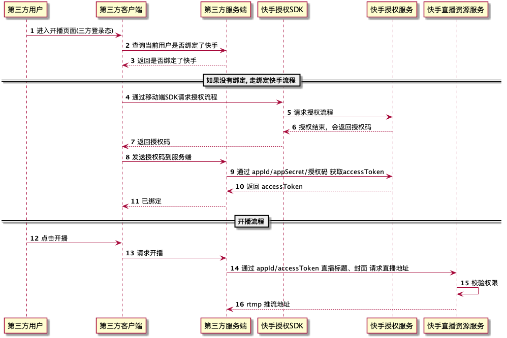

## 接入快手授权和鉴权服务

> **授权流程说明**

## 

### 1. 移动端SDK授权方式

适用于客户端应用，具体授权方式可以参照文档：https://docs.qq.com/doc/DRnVkcXNMVllpSHFC

### 2. 授权码授权模式（Authorization Code）

适用于H5应用和WEB应用

#### 2.1 授权码（authorization_code）获取接口

**此接口为前端接口**

| 接口     | `https://open.kuaishou.com/oauth2/authorize` |
| -------- | -------------------------------------------- |
| 请求方式 | `GET`                                        |

**请求参数**

| 参数名          | 必填 | 描述                                                         |
| --------------- | ---- | ------------------------------------------------------------ |
| `app_id`        | 是   | 开发者 appId                                                 |
| `response_type` | 是   | 授权的类型，可以是 "code"                                    |
| `scope`         | 是   | 需要获得的权限，多个用 “,” 连接。比如 user_info,payment。见下文的 scope 列表 |
| `redirect_uri`  | 是   | 授权成功的回调 uri，需要在注册时提供白名单 (通过客户端 SDK 通信时，可以使用一个内置的 schema 协议，待定) |
| `state`         |      | 状态值，成功授权后回调时会原样带回                           |
| `ua`            |      | "h5 \| pc", 默认为h5。如果是 pc web 端请指定"pc"             |

**返回值**

如果授权成功，授权服务器会将用户的浏览器重定向到：`http(s)://redirect_uri?code=CODE&state=STATE`

| `code`  | 是   | `string` | 用来换取 access_token 的授权码，有效期为 10 分钟且只能使用一次 |
| ------- | ---- | -------- | ------------------------------------------------------------ |
| `state` | 否   | `string` | 如果请求时传递参数，会回传该参数                             |

#### 2.2 访问令牌（access_token）获取接口

**此接口为后端接口** 

| 接口     | `https://open.kuaishou.com/oauth2/access_token` |
| -------- | ----------------------------------------------- |
| 请求方式 | `GET`                                           |

**请求参数**

| 参数名       | 必填 | 描述                      |
| ------------ | ---- | ------------------------- |
| `app_id`     | 是   | 开发者 appId              |
| `grant_type` | 是   | 授权的类型，可以是 "code" |
| `code`       | 是   | 3.1.1中获取到的           |
| `app_secret` | 是   | 开发者的appSecret         |

```json
//返回值示例（成功）
{
    "result": 1,
    "access_token": "xxxxxxx", // 用于获取隐私资源
    "refresh_token": "xxxxxx", // 用户刷新access_token
    "open_id": "xxxxx", // 用户对该开发者的唯一身份标识
    "expires_in": 3600 // 过期时间（秒）
}
//返回值示例（异常）
{
  "result": 100200000,
  "error": "invalid_request",
  "error_msg": "参数错误" //用于提示错误原因，支持多语言
}
```

#### 2.3 访问令牌更新（Refresh Token）

随接口返回一个过期时间。 **此接口为后端接口**

| 接口     | `https://open.kuaishou.com/oauth2/refresh_token` |
| -------- | ------------------------------------------------ |
| 请求方式 | `GET`                                            |

**请求参数**

| **参数名**      | 必填 | **描述**                         |
| --------------- | ---- | -------------------------------- |
| `app_id`        | 是   | 开发者 appId                     |
| `grant_type`    | 是   | 授权的类型，填写 "refresh_token" |
| `refresh_token` | 是   | 3.1.2中获取到的                  |
| `app_secret`    | 是   | 开发者的appSecret                |

```json
//返回值示例（成功）
{
  "result": 1,
  "access_token": "xxxxxxx", //用于获取隐私资源
  "refresh_token": "xxxxxx", //用户刷新
  "expires_in": 3600 //过期时间（秒）
}
//返回值示例（异常）
{
  "result": 100200000,
  "error": "invalid_request",
  "error_msg": "参数错误" //用于提示错误原因，支持多语言
}
```

### 3 错误码说明

| **result** | **error**                 | **异常描述**                                                 |
| ---------- | ------------------------- | ------------------------------------------------------------ |
| 100200100  | invalid_request           | 缺少必要的请求参数                                           |
| 100200101  | unauthorized_client       | app 非法，例如: 开发者不存在，app 不存在或状态不正确等       |
| 100200102  | access_denied             | 请求被拒绝，授权和后续 API 访问中出现任何的 Token 错误都会返回这个异常 |
| 100200103  | unsupported_response_type | responseType 错误                                            |
| 100200104  | unsupported_grant_type    | 换取 accessToken 使用的 grantType 错误                       |
| 100200105  | invalid_grant             | 换取 accessToken 使用的 code 错误                            |
| 100200106  | invalid_scope             | 权限 scope 错误，或者用户取消了授权等                        |
| 100200107  | invalid_openid            | 用户的 openid 无效                                           |
| 100200500  | server_error              | 服务器内部错误，开发者侧无法处理                             |

### 4 支持的 Scope 列表

| Scope             | 描述               | 备注         |
| ----------------- | ------------------ | ------------ |
| `user_base`       | 授权之后的默认权限 | 不用显式配置 |
| `user_info`       | 用户基本信息       |              |
| `user_video_live` | 用户直播权限       |              |

# 